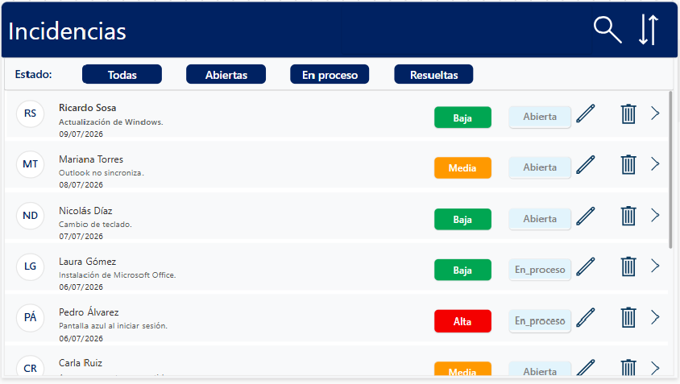
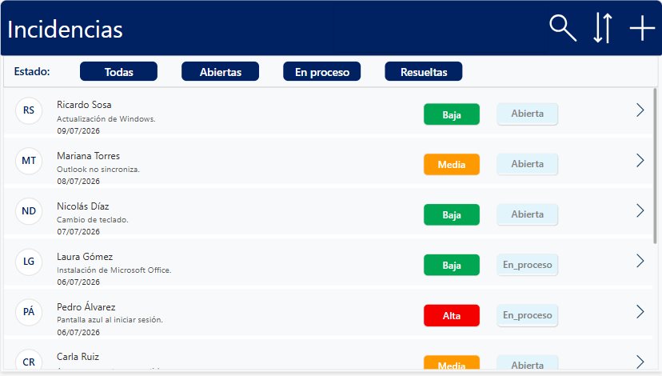
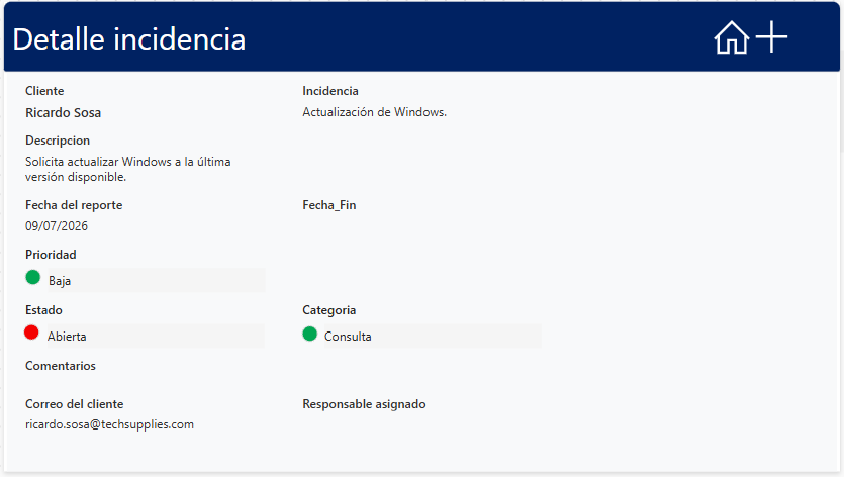

# TechSupplies Service Desk

Aplicación de gestión de incidencias desarrollada con Power Apps, SharePoint y Power Automate.

## Descripción

TechSupplies Service Desk es una aplicación desarrollada con Microsoft Power Platform para gestionar incidencias reportadas por clientes.

La solución integra Power Apps, SharePoint y Power Automate para administrar el ciclo completo de una incidencia, desde su creación hasta su resolución, incorporando validaciones, control por roles y mejoras en la experiencia de usuario.

## Características principales

- Gestión de incidencias.
- Control de acceso por roles.
- Registro y edición de solicitudes.
- Estados y prioridades.
- Búsqueda dinámica.
- Filtros por estado.
- Integración con SharePoint.
- Automatización mediante Power Automate.
- Validaciones utilizando Power Fx.

## Tecnologías utilizadas

- Power Apps
- Power Fx
- SharePoint Online
- Power Automate
- Office 365 Outlook
- Microsoft 365

## Funcionalidades

- Registro de incidencias.
- Consulta y seguimiento de solicitudes.
- Gestión de estados y prioridades.
- Administración por roles.
- Búsqueda y filtrado.
- Validaciones de datos.
- Integración con SharePoint.
- Automatización mediante Power Automate.

## Capturas de pantalla

### Pantalla principal

### Detalle de incidencia

### Edición

## Arquitectura

Power Apps
      │
      ▼
Power Fx
      │
      ▼
SharePoint
      │
      ▼
Power Automate
      │
      ▼
Office 365 Outlook

## Documentación

La documentación completa del proyecto puede consultarse en:

- [Documentación del proyecto](documentacion/Documentacion.md)

## Aprendizajes

Durante el desarrollo se aplicaron conceptos relacionados con:

- Colecciones.
- Variables globales.
- Variables de contexto.
- Formularios.
- Navegación entre pantallas.
- Patch.
- Filter.
- LookUp.
- Validaciones.
- Integración con SharePoint.
- Automatización mediante Power Automate.
- Desarrollo de lógica utilizando Power Fx.

## Estado del proyecto

🟢 Proyecto finalizado.

Incluye mejoras funcionales y de experiencia de usuario respecto de la versión desarrollada originalmente con fines académicos.

## Autor

**Andrea Natalia Tello**

- GitHub: [AnNaTe07](https://github.com/AnNaTe07)
- LinkedIn: [Andrea Natalia Tello](https://www.linkedin.com/in/andrea-natalia-tello-623874325/)
