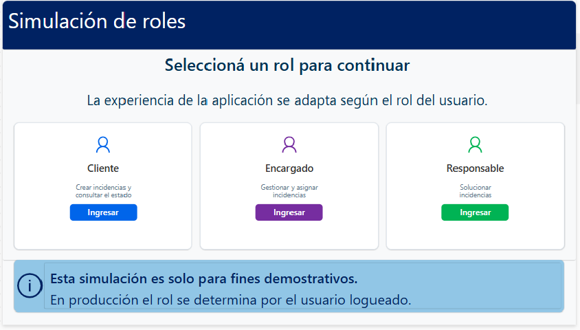
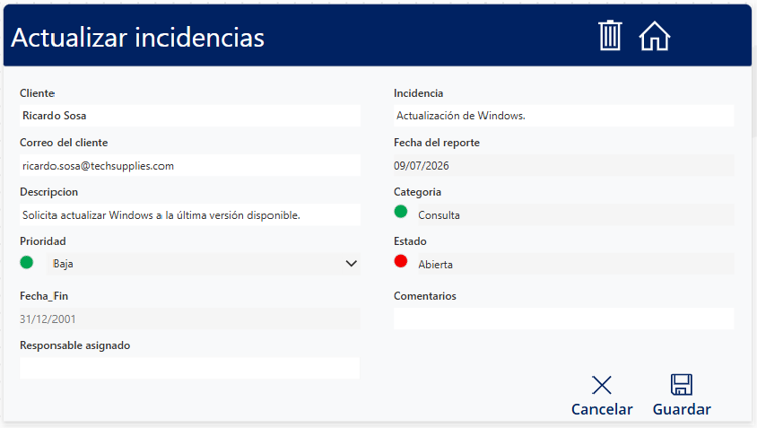
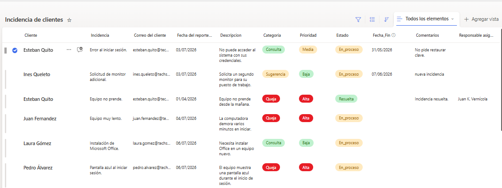

# Sistema de Gestión de Incidencias

Aplicación desarrollada con **Microsoft Power Apps**, utilizando **SharePoint Online** como origen de datos y **Power Fx** para implementar la lógica de negocio.

La solución permite registrar, administrar y realizar el seguimiento de incidencias mediante un flujo de trabajo basado en roles, centralizando toda la información en SharePoint Online.

---

# Capturas de la aplicación

## Simulación de roles



---

## Pantalla principal


---

## Detalle de incidencia


---

## Edición de incidencia



---

# Descripción del proyecto

El Sistema de Gestión de Incidencias es una solución desarrollada con Microsoft Power Platform para administrar el ciclo completo de vida de incidencias reportadas por clientes.

La aplicación implementa un flujo de trabajo basado en roles, permitiendo que cada usuario acceda únicamente a las funcionalidades correspondientes a sus responsabilidades dentro del proceso de gestión.

Toda la información se almacena en SharePoint Online, facilitando la centralización de los datos, el seguimiento de cada solicitud y la actualización del estado de las incidencias desde una única aplicación.

---

# Objetivos

El proyecto fue desarrollado con los siguientes objetivos:

- Registrar incidencias reportadas por clientes.
- Centralizar toda la información en SharePoint Online.
- Implementar un flujo de trabajo basado en roles.
- Administrar el ciclo completo de vida de una incidencia.
- Asignar prioridades y responsables.
- Gestionar el estado de cada solicitud.
- Mantener un historial de incidencias.
- Diseñar una interfaz clara, intuitiva y fácil de utilizar.

---

# Caso de negocio

Una empresa dedicada al soporte técnico recibe diariamente solicitudes relacionadas con inconvenientes técnicos, consultas y sugerencias.

Para administrar correctamente estas solicitudes resulta necesario centralizar la información, asignar responsables, establecer prioridades y realizar el seguimiento de cada incidencia hasta su resolución.

La solución desarrollada permite gestionar todo el proceso desde una única aplicación, facilitando el trabajo de los distintos perfiles involucrados y mejorando el seguimiento de cada solicitud.

---

# Tecnologías utilizadas

| Tecnología | Función |
|------------|---------|
| Microsoft Power Apps | Desarrollo de la aplicación |
| SharePoint Online | Almacenamiento centralizado de datos |
| Power Fx | Implementación de la lógica de negocio |
| Controles modernos | Construcción de la interfaz de usuario |
| Variables globales y de contexto | Gestión del estado de la aplicación |

---

# Arquitectura

```text
           Usuario
               │
               ▼
         Microsoft Power Apps
               │
               ▼
        SharePoint Online
               │
               ▼
      Lista de Incidencias
```

La aplicación utiliza una lista de SharePoint Online como origen de datos principal.

Toda la información relacionada con las incidencias se almacena y administra desde dicha lista, permitiendo crear, consultar y actualizar registros directamente desde Power Apps mediante Power Fx.

---

# Modelo de datos

| Campo | Tipo | Descripción |
|--------|------|-------------|
| Cliente | Texto | Nombre del cliente que registra la incidencia |
| Incidencia | Texto | Título de la incidencia |
| Correo del cliente | Texto | Correo electrónico del cliente |
| Fecha del reporte | Fecha y hora | Fecha de creación de la incidencia |
| Descripción | Texto | Descripción detallada del problema |
| Categoría | Opción | Queja, Consulta o Sugerencia |
| Prioridad | Opción | Alta, Media o Baja |
| Estado | Opción | Abierta, En progreso o Resuelta |
| Fecha_Fin | Fecha y hora | Fecha de resolución |
| Comentarios | Texto | Observaciones adicionales |
| Responsable asignado | Texto | Usuario responsable de la resolución |

---

# Flujo de trabajo

```text
Cliente registra una incidencia
            │
            ▼
Estado inicial: Abierta
            │
            ▼
Asignación de prioridad
            │
            ▼
Asignación de responsable
            │
            ▼
Estado: En progreso
            │
            ▼
Estado: Resuelta
            │
            ▼
Registro de la fecha de resolución
```

El estado **Abierta** se asigna automáticamente mediante un valor predeterminado configurado en SharePoint, garantizando que toda nueva incidencia inicie correctamente su ciclo de vida.

---

# Roles implementados

## Cliente

### Funciones

- Registrar nuevas incidencias.
- Consultar únicamente sus propias incidencias.
- Visualizar el detalle de cada solicitud.
- Consultar el estado de las incidencias.

### Restricciones

No puede:

- Modificar la prioridad.
- Asignar responsables.
- Cambiar el estado.
- Registrar la fecha de resolución.

---

## Encargado

### Funciones

- Consultar todas las incidencias.
- Asignar prioridades.
- Asignar responsables.
- Administrar la información general de cada incidencia.

### Restricciones

No interviene en la resolución técnica de las incidencias.

---

## Responsable

### Funciones

- Actualizar el estado de la incidencia.
- Registrar la fecha de resolución.
- Completar comentarios finales sobre la atención.

---

# Navegación

```text
Simulación de roles
          │
          ▼
Listado de incidencias
          │
          ▼
Detalle
          │
          ▼
Editar
          │
          ▼
Guardar cambios
          │
          ▼
Listado actualizado
```

---

# Variables principales

| Variable | Tipo | Función |
|----------|------|---------|
| varRol | Global | Almacena el rol seleccionado |
| varEmail | Global | Almacena el correo del usuario |
| varOrdenAsc | Global | Controla el orden ascendente o descendente de la galería |
| varBuscar | Contexto | Controla la visibilidad del buscador |
| varFiltroEstado | Global | Filtra las incidencias según su estado |


---

# Funcionalidades implementadas

## Gestión de incidencias

La aplicación permite administrar el ciclo completo de una incidencia mediante las siguientes funcionalidades:

- Registro de nuevas incidencias.
- Consulta de incidencias.
- Visualización del detalle de cada solicitud.
- Actualización de la información.
- Seguimiento del estado de resolución.

---

## Gestión por roles

La aplicación incorpora un sistema de acceso basado en roles, permitiendo que cada usuario visualice únicamente las funcionalidades correspondientes a sus responsabilidades.

Los roles disponibles son:

- Cliente.
- Encargado.
- Responsable.

Cada uno dispone de permisos específicos sobre los datos y las acciones disponibles dentro de la aplicación.

---

## Simulación de roles

Para facilitar las pruebas y demostraciones del funcionamiento completo de la aplicación, se incorporó una pantalla de simulación de roles.

Esta funcionalidad permite representar distintos perfiles de usuario dentro del mismo entorno de trabajo sin necesidad de utilizar múltiples cuentas de Microsoft 365.

---

## Búsqueda dinámica

La pantalla principal incorpora un buscador que permite localizar incidencias utilizando coincidencias parciales.

La búsqueda puede realizarse por:

- Cliente.
- Incidencia.
- Prioridad.
- Estado.

La búsqueda no distingue entre mayúsculas y minúsculas, facilitando la localización de información.

---

## Ordenamiento

La galería permite ordenar las incidencias según la fecha del reporte.

El usuario puede alternar entre:

- Orden ascendente.
- Orden descendente.

---

## Filtrado por estado

Las incidencias pueden filtrarse según su estado para facilitar el seguimiento del trabajo.

Opciones disponibles:

- Todas.
- Abiertas.
- En progreso.
- Resueltas.

---

# Diseño de la interfaz

La interfaz fue diseñada priorizando la claridad de la información y la facilidad de uso.

Para ello se implementaron las siguientes características:

- Uso de contenedores modernos para organizar la información.
- Encabezado con identidad visual unificada.
- Avatar generado automáticamente mediante las iniciales del cliente.
- Badges para representar visualmente el Estado y la Prioridad.
- Paleta de colores consistente en toda la aplicación.
- Tipografía uniforme.
- Distribución adaptable de los controles.
- Jerarquía visual mediante tamaños de fuente y espaciado.

---

# Decisiones de diseño

Durante el desarrollo se adoptaron distintos criterios para mejorar la experiencia de usuario.

Entre las principales decisiones se destacan:

- La prioridad únicamente es visible para el Encargado y el Responsable, ya que representa información interna del proceso.
- El estado permanece visible para todos los usuarios, permitiendo que el cliente conozca el avance de su solicitud.
- Toda nueva incidencia se registra automáticamente con estado **Abierta**.
- El buscador permanece oculto hasta que el usuario lo solicita mediante el icono correspondiente, optimizando el espacio disponible en la interfaz.

---

# Características destacadas

Entre las principales características implementadas se encuentran:

- Gestión completa de incidencias.
- Flujo de trabajo basado en roles.
- Integración con SharePoint Online.
- Búsqueda dinámica.
- Filtrado por estado.
- Ordenamiento por fecha.
- Avatares generados automáticamente.
- Badges para Estado y Prioridad.
- Organización mediante contenedores modernos.
- Código organizado utilizando nombres descriptivos para variables y controles.
- Implementación de la lógica mediante Power Fx.

---

# Integración con SharePoint

La aplicación utiliza SharePoint Online como origen centralizado de datos.

Toda la información relacionada con las incidencias se almacena en una única lista, permitiendo crear, consultar y actualizar registros directamente desde Power Apps.

Esta integración simplifica la administración de la información y mantiene sincronizados todos los datos utilizados por la aplicación.

---

# Captura de SharePoint

## Lista de Incidencias



---

# Conceptos de Power Platform aplicados

Durante el desarrollo se implementaron diversos conceptos de Microsoft Power Platform, entre ellos:

- Variables globales.
- Variables de contexto.
- Colecciones.
- Formularios.
- Navegación entre pantallas.
- Controles modernos.
- Funciones Filter.
- Funciones Sort.
- Funciones LookUp.
- Funciones Patch.
- Manipulación de registros en SharePoint.
- Validaciones mediante Power Fx.
- Gestión de permisos basada en roles.

---

# Posibles mejoras futuras

La arquitectura de la aplicación permite incorporar nuevas funcionalidades sin modificar la estructura principal.

Entre las posibles mejoras se encuentran:

- Notificaciones automáticas por correo electrónico.
- Panel de indicadores mediante Power BI.
- Historial completo de cambios por incidencia.
- Adjuntar archivos a las incidencias.
- Comentarios entre usuarios.
- Priorización automática según la categoría.
- Dashboard para métricas de atención.

---

## Buenas prácticas

Durante el desarrollo del proyecto se implementaron distintas estrategias para mejorar la mantenibilidad y escalabilidad de la aplicación.

- Control de acceso mediante roles.
- Validaciones utilizando Power Fx.
- Reutilización de pantallas.
- Navegación desacoplada.
- Integración con SharePoint Online.
- Automatización mediante Power Automate.
- Organización de fórmulas para facilitar el mantenimiento.

---

# Conclusión

El Sistema de Gestión de Incidencias es una solución desarrollada con Microsoft Power Apps y SharePoint Online para administrar el ciclo completo de vida de incidencias mediante un flujo de trabajo basado en roles.

La aplicación integra formularios, galerías, filtros, búsquedas, validaciones y navegación entre pantallas, utilizando Power Fx para implementar la lógica de negocio y SharePoint Online como origen centralizado de datos.

Como resultado, se obtuvo una solución organizada, escalable y de fácil mantenimiento, orientada a optimizar la gestión de incidencias y mejorar la experiencia de los usuarios.
